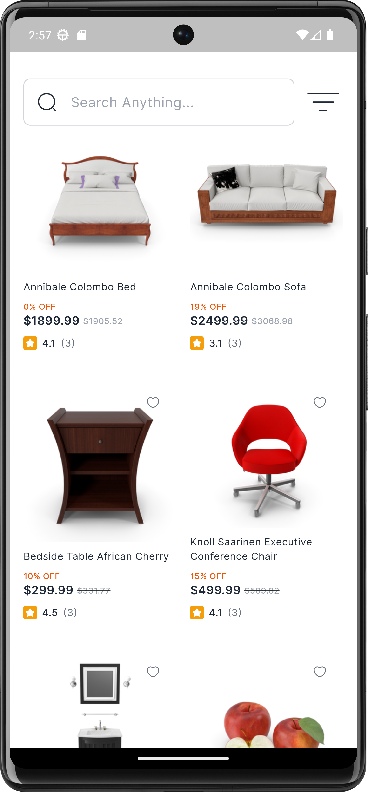
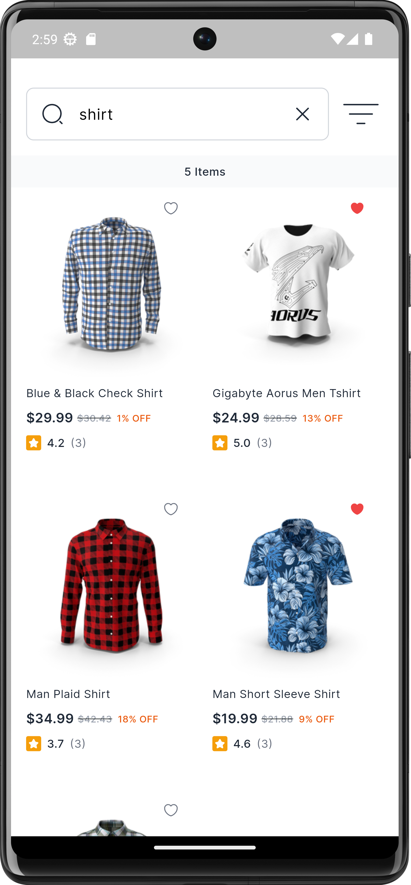
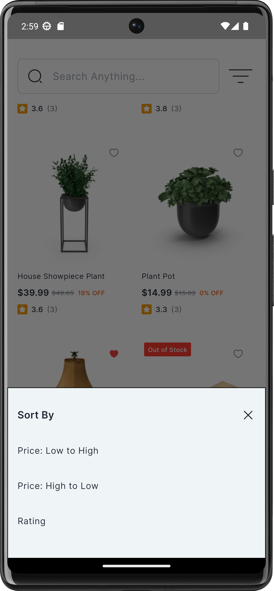

# QStore - Flutter E-Commerce App

A modern e-commerce application built with Flutter implementing clean architecture principles and robust state management.

### Download

[Download QStore](https://shorturl.at/uEJhG)

## Screenshots

<div style="display: flex; gap: 10px;">
  
  
  
</div>

## Features

### Product Management
- **Advanced Search**: Search products by name and description
- **Smart Sorting**:
  - Sort by price (low to high)
  - Sort by price (high to low) 
  - Sort by rating
- **Infinite Scrolling**: Smooth product loading with pagination
- **Cached Images**: Efficient image loading and caching system

### Technical Features
- **Clean Architecture**: Separation of concerns with layers (presentation, domain, data)
- **BLoC Pattern**: Robust state management using Flutter Bloc
- **Network Handling**:
  - Dio for API integration
  - Network connectivity checker using ConnectivityPlus
  - Internet connection monitoring with Lookup
- **Local Storage**: Hive for efficient local data persistence
- **Testing**: Comprehensive unit tests and widget tests

## Technical Stack

- **State Management**: Flutter Bloc
- **Networking**: Dio
- **Local Storage**: Hive
- **Image Caching**: Cached Network Image
- **Network Connectivity**: ConnectivityPlus, Lookup
- **Testing**: Flutter Test

## Project Structure

    lib/
    ├── core/
    │   ├── constants/
    │   ├── service/
    │   │   ├── bloc_services/
    │   │   ├── local_data_services/
    │   │   └── network_services/
    │   ├── shared/
    │   ├── themes/
    │   └── utils/
    ├── features/
    │   ├── data/
    │   │   ├── datasources/
    │   │   │   ├── product_remote_data_source.dart
    │   │   │   └── product_local_data_source.dart
    │   │   ├── models/
    │   │   │   └── product_model.dart
    │   │   └── repositories/
    │   │       └── product_repository_impl.dart
    │   ├── domain/
    │   │   ├── repositories/
    │   │       └── product_repository.dart
    │   │
    │   └── presentation/
    │       ├── bloc/
    │       │   ├── product_bloc.dart
    │       │   ├── product_event.dart
    │       │   └── product_state.dart
    │       ├── view/
    │       │   └── home_page.dart
    │       │   
    │       └── widget/
    │           ├── product_tile.dart
    │           └── sort_dropdown.dart
    └── main.dart

    test/
    ├── bloc/
    │   └── product_bloc_test.dart
    ├── usecases/
    │   └── sort_products_test.dart
    └── widgets/
        └── product_tile_test.dart


## Installation

### Prerequisites

- [Flutter SDK](https://flutter.dev/docs/get-started/install)
- A compatible IDE (Android Studio, VS Code, or IntelliJ IDEA)
- An emulator or physical device for testing

### Getting Started

1. Clone the repository:
   ```bash
   git clone https://github.com/zsifat/qstore.git
   ```

2. Navigate to the project directory:
   ```bash
   cd qstore
   ```

3. Install dependencies:
   ```bash
   flutter pub get
   ```

4. Run the app:
   ```bash
   flutter run
   ```


## License

This project is licensed under the MIT License - see the [LICENSE](LICENSE) file for details.

## Contact

Zahidul Islam |
Flutter Developer |
Email: zahidulislamsifat1@gmail.com |
LinkedIn: [Zahidul Islam](https://www.linkedin.com/in/zahidulislam1/) | GitHub: [@zsifat](https://github.com/zsifat)

Project Link: [https://github.com/zsifat/qstore](https://github.com/zsifat/qstore)

Feel free to reach out if you have any questions or suggestions about the project!


